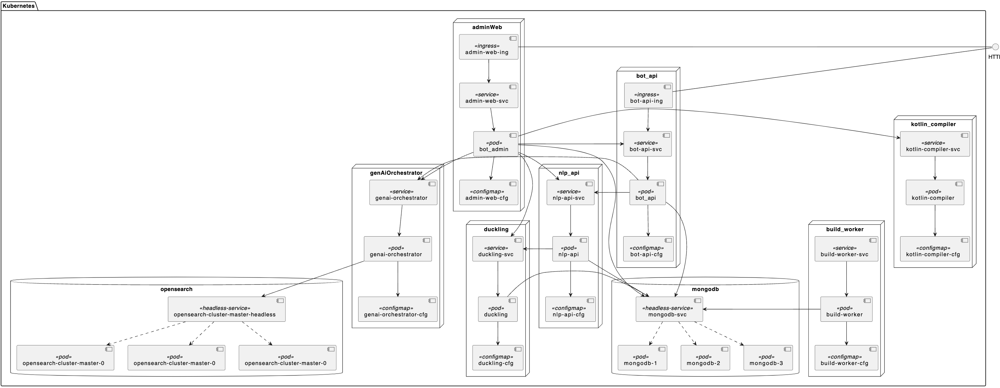

# Helm Chart for Tock  (theopenconversationkit)


[Tock](https://doc.tock.ai/fr/), an open conversational AI platform provides a complete solution to build conversational agents, aka bots.

Tock can integrate and experiment with both classic and generative AI (LLM, RAG) models.


## Quick start

```console 
$ helm install mytock ./charts/tock
```

## Usage

The chart is distributed as an OCI Artifact as well as via a traditional Helm Repository.

- OCI Artifact: `oci://ghcr.io/theopenconversationkit/charts/tock`
- Helm Repository: `https://theopenconversationkit.github.io/tock-helm-chart/` with chart `tock`

## Install Chart

```console
$ helm install [RELEASE_NAME] oci://ghcr.io/theopenconversationkit/charts/tock --version 0.6.3
```

or

```console
helm repo add tock https://theopenconversationkit.github.io/tock-helm-chart/
helm repo update
helm search repo tock
helm install [RELEASE_NAME] tock/tock --version 0.6.3
```

You will find more information on chart parameters at the helm chart [README](charts/tock/README.md).

## What is deployed 

The chart deploys all tock components. It's also able to deploy a mongodb database (Bitnami mongoDb chart is used as subchart) or use an existing mongodb backend. In the same feeling, since version 24.3.2 of tock, open search can be deployed as a sub chart (opensearch chart is used as subchart) and since version 24.9.3 PGvector can be deployed as a sub chart (bitnami chart is used as subchart).

Deployment with OpenSearch as vector database.


